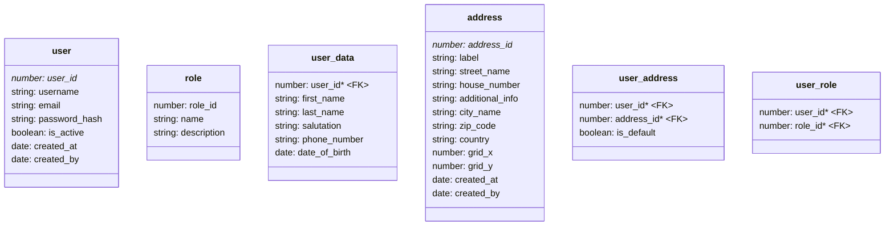
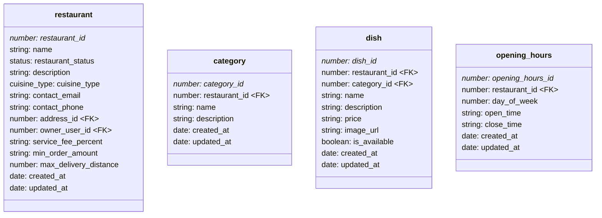
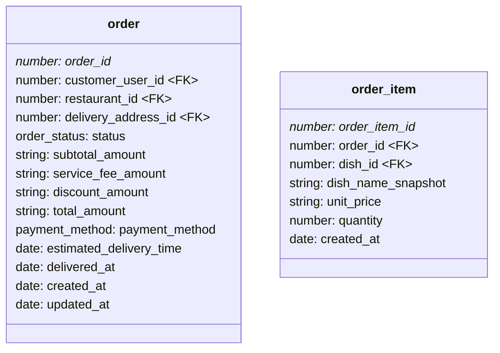
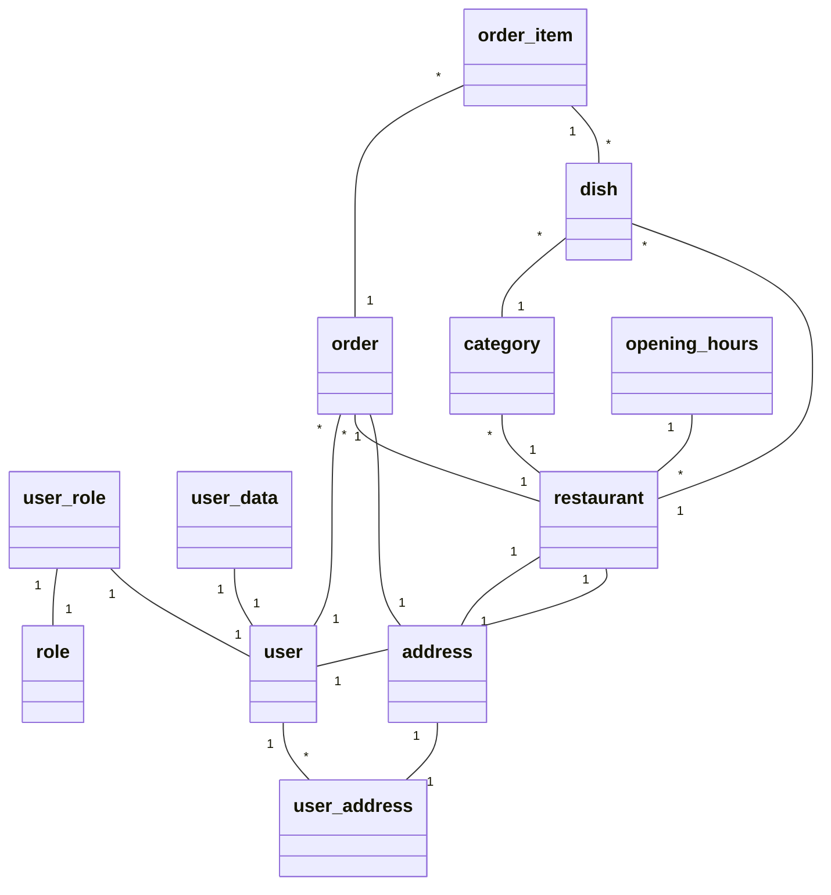

# Project Overview

## Platform Description

## System Architecture Diagram

The repository-root contains three folders containing the Angular frontend (`client`), the database migrations (`db`) and the backend (`server`). The Customer uses the frontend to communicate with the server. Data on the database is exclusively accessed via the server.

```mermaid
architecture-beta

group proj[freelivery]

service db(mdi:storage)[Database] in proj
service client(mdi:accounts)[Frontend] in proj
service server(mdi:server)[Server] in proj

client:T -- B:server
server:R -- L:db
```



### Frontend

```
.
├── src
│   ├── app
│   ├── commons
│   │   ├── guards
│   │   ├── interceptors
│   │   ├── model
│   │   ├── pipes
│   │   └── services
│   ├── layout
│   └── modules
│       ├── customer
│       ├── profile
│       ├── restaurant-manager
│       └── site-manager
```

### Backend

```
.
├── src
│   ├── domains
│   │   ├── commons
│   │   ├── location
│   │   ├── order
│   │   ├── restaurant
│   │   └── user
│   ├── middleware
│   ├── modules
│   │   ├── customer
│   │   ├── restaurant-owner
│   │   └── site-manager
│   └── routes
└── uploads
```

### Database

Note: the datatypes given in the diagram are the ones used in the backend; `DECIMAL` and `TIME` types are parsed as strings.

#### User



#### Restaurant

Order data contains redundant data for historic reasons.







# Module Responsibilities

## Restaurant Owner

### REST API

## Shared Components and Backend Services

### User Registration & Authentication

Related code-parts:

- `server/src/routes/auth.routes.ts`
- `server/src/middleware/auth.ts`
- `client/src/commons/interceptors/authenticator.interceptor.ts`
- `client/src/commons/guards/auth.guard.ts`
- `client/src/commons/services/authentication.service.ts`
- `client/src/layout/login/*`
- `client/src/layout/signup/*`

### Profile Management

### Responsive UI

### Error Handling

Related code-parts:

- `server/src/middleware/not-found.ts`
- `server/src/domains/commons/errors.ts`
- `client/src/commons/interceptors/serverError.interceptor.ts`

### Async Handler

Related code-parts:

- `server/src/middleware/async-handler.ts`

### Navigation & Routing

- `client/src/layout/navbar/*`
- `server/index.ts`

### Distance Simulation

# Extra Tasks

# Setup Instructions
