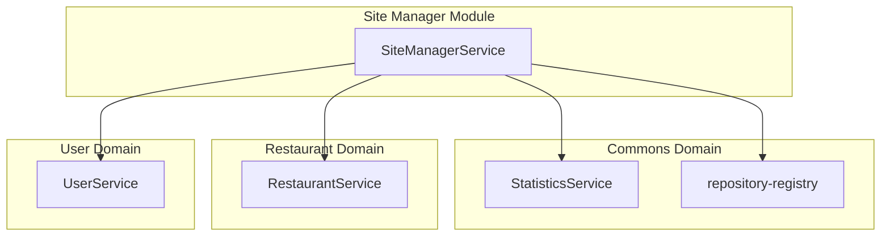
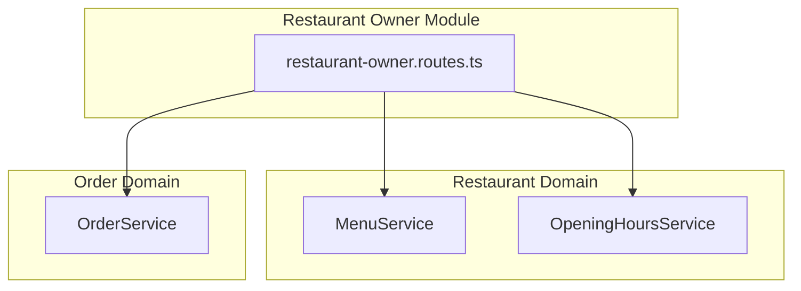
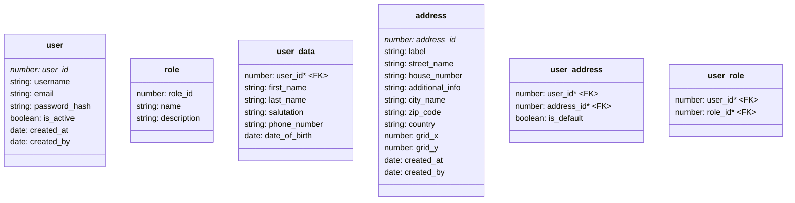
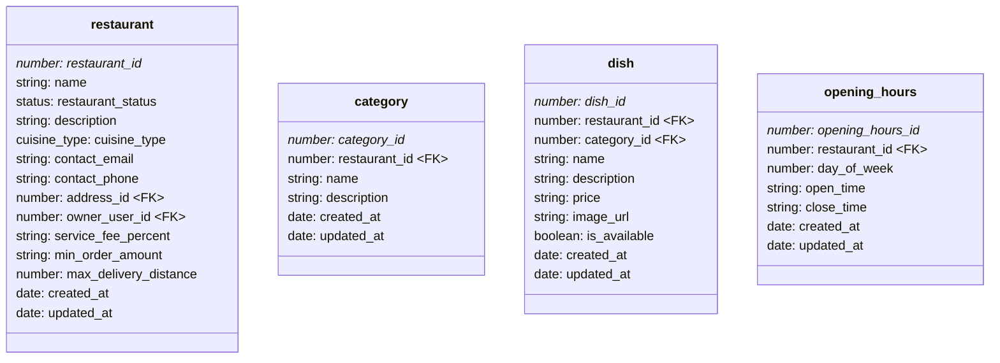
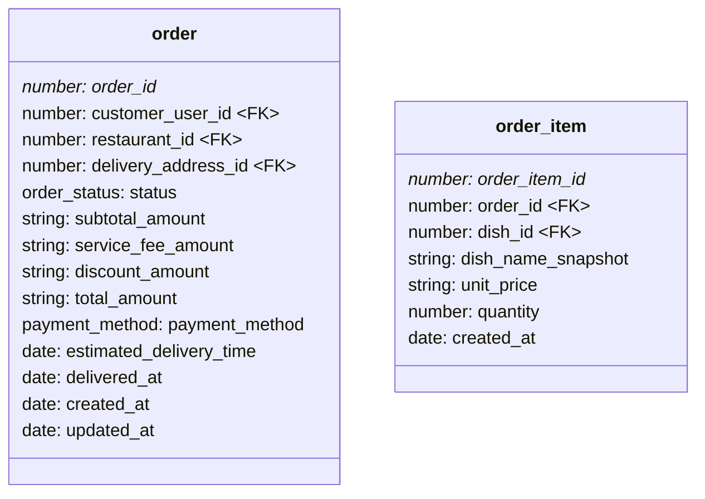
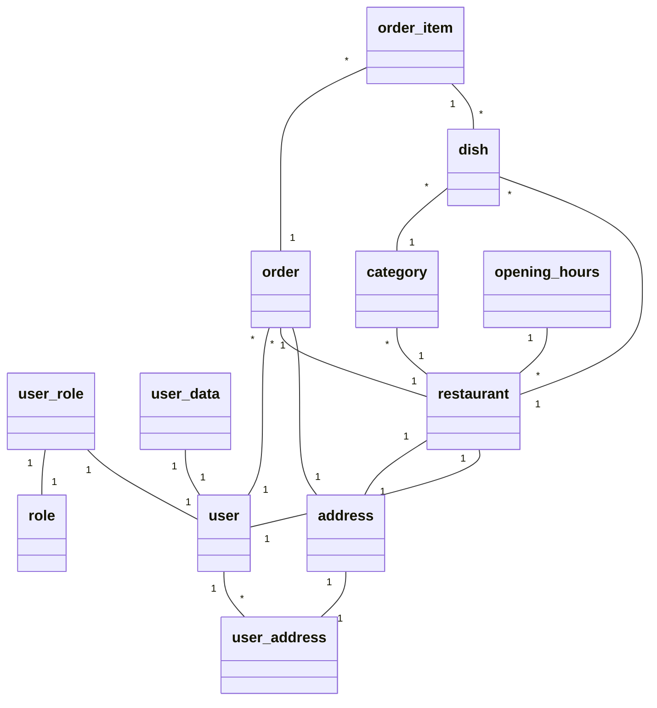
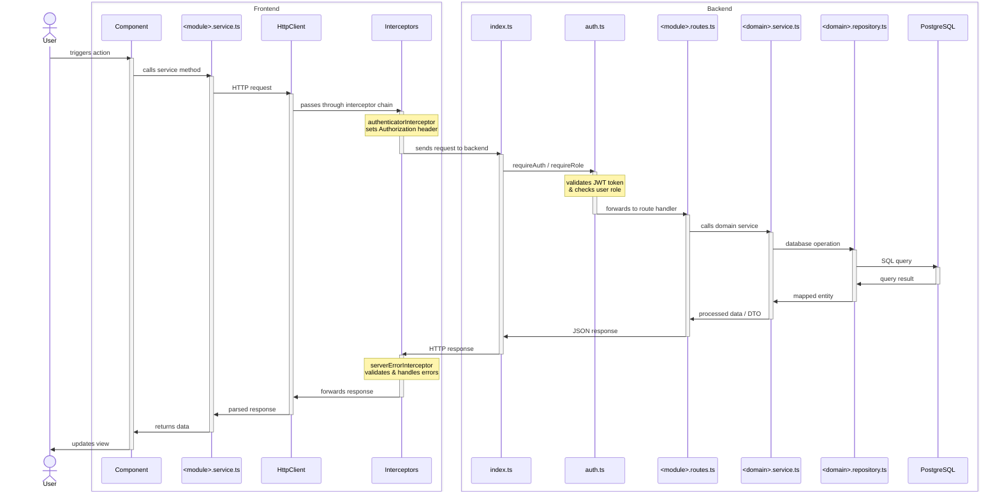
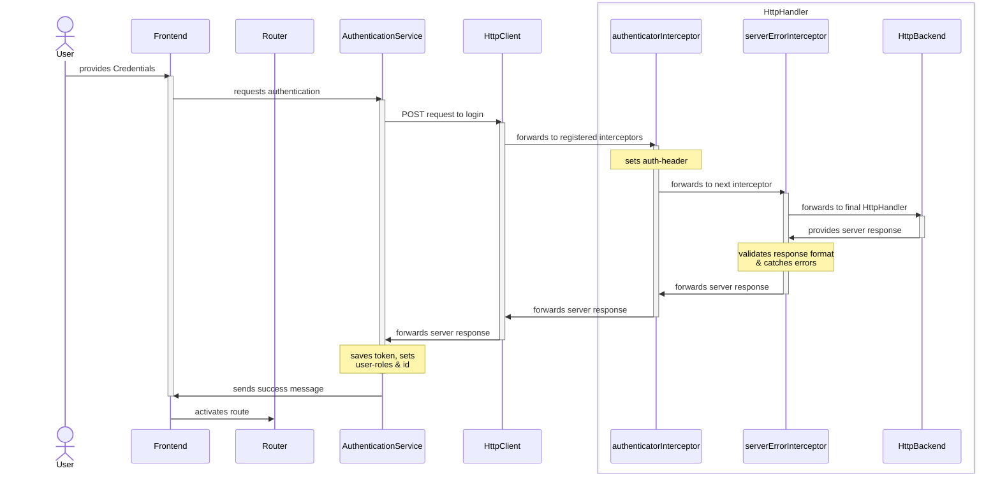

# System Architecture

The repository-root contains three folders containing the Angular frontend (`client`), the database migrations (`db`) and the backend (`server`). The Customer uses the frontend to communicate with the server. Data on the database is exclusively accessed via the server.

| Topic            | Responsible Person |
| :--------------- | :----------------- |
| Site Manager     | Armin              |
| Restaurant Owner | Armin              |
| Customer (User)  | Miriam             |

## Feature Descriptions

### Shared Features

During user registration users

- have to provide required data and
- can choose which role they want to have.
    - additional information for restaurants has to be provided if "Restaurant Owner" is chosen

Profile management allows users to

- update their personal data,
- manage multiple addresses and
- changing their password.

### Site-Admin

The `site-admin@freelivery.com` user provides all testdata for the given functionality. It can:

- get an overview of some core statistics
- see all active restaurants and set a service-fee for each
- see pending erstaurant requests and approve/decline them
- check user details and suspend them

### Restaurant-Owner

The `restaurant-owner@freelivery.com` user provides all testdata for the given functionality. It can:

- manage the menu by
    - creating and editing categories including
        - a category name and
        - a category description
    - creating and editing dishes including
        - an image,
        - a dish name,
        - optional description and
        - price.
    - setting dishes as unavailable
    - deleting dishes and categories
- manage orders by
    - accepting or rejecting them and
    - updating their status throughout the process.
- manage their opening hours
- get basic analytics for their restaurant like
    - weekly orders and revenue,
    - a daily breakdown of the last weeks
    - identifying most ordered dishes.

## Frontend

```
.
├── src
│   ├── app
│   ├── commons
│   │   ├── guards
│   │   ├── interceptors
│   │   ├── model
│   │   ├── pipes
│   │   └── services
│   ├── layout
│   └── modules
│       ├── customer
│       ├── profile
│       ├── restaurant-manager
│       └── site-manager
```

### Navigation & Network

`app.routes.ts`

- defines routes to
    - central functions
        - login, signup, profile
    - lazy loaded modules
        - customer
        - restaurant
        - site-manager
        - profile
- where necessary, routes are protected via `canActivate` using `authGuard`
    - module-specific routes are defined in their respective routes-file

`auth.guard.ts`

- uses the `authentication.service.ts` to verify whether a user is logged in and
- verifies that the logged in user posseses the role required for a given route

`authenticator.interceptor.ts`

- clones request (conceptually immutable) and sets authorization header

`serverError.interceptor.ts`

- taps into responses and verifies their format and
- catches any HttpErrors and surfaces them in a dismissible snackbar

`app.config.ts`

- `provideHttpClient(withInterceptors([…,…]))` provides the interceptors as `HttpHandler` to the `HttpClient` in the given order

### Modules

#### Site-manager

- all functionality is contained in the `site-manager-home`
- `site-manager.models.ts` contains site-manager specific models for
    - pending restaurant registrations
    - user management and
    - dashboard statistics

#### Restaurant-owner

- `restaurant-owner.routes.ts`
    - defines lazy-loded routes used in `app.routes.ts`
- `restaurant-owner.service.ts`
    - contains general DTOs and DTOs for creating/updating given entities
    - provides methods used solely by the `restaurant-owner`-module
        - all calls to `/api/restaurant-owner` require the `restaurant-owner` role (see backend section)
        - manipulating restaurant-owner specific entities
- other folders in the module
    - contain form-elements and other reusable components

## Backend

```
.
├── src
│   ├── domains
│   │   ├── commons
│   │   ├── location
│   │   ├── order
│   │   ├── restaurant
│   │   └── user
│   ├── middleware
│   ├── modules
│   │   ├── customer
│   │   ├── restaurant-owner
│   │   └── site-manager
│   └── routes
└── uploads
```

### Domains

- `commons` contains general-purpose classes and services shared across different modules
    - `abstract-repository` defines an abstract singleton class which manages the database connection
    - `errors`
        - provides the `expressErrorHandler` which converts any generic errors into `AppError`s
        - generate HTTP error responses from `AppError`
        - provides pre-defined errors which can be thrown in the code together with a error-message for the client
    - `repository-registry` provides methods to get the corresponding repositories
    - `statistics-repository` + `stastics-service` for shared statistics
- `location`, `order`, `restaurant`, `user` group shared and domain-specific models and functionalities like repositories and services

### Middleware

- `middleware` defines all middleware for …
    - authentication
    - logging
    - file-upload
    - not-found handling

### Routing

Routing is split into multiple parts:

- some generally available entities provide routes for authenticated users
    - `restaurant` domain exposes all categories and dishes for a restaurant and all active restaurants
    - authentication is verified via a `requireAuth` middleware
- anything requiring a specific `role` is only available to users with that given role
    - this is realised using a `requireRole` middleware
    - routes are defined in that modules's folder

`index.ts`

- entrypoint for HTTP requests
- `/uploads` served statically for image hosting
- _public_ endpoints:
    - `/api/auth` to authenticate users
- _authenticated_ endpoints: any logged in user can access them
    - `/api/addresses`
        - CRUD endpoints for addresses
    - `/api/restaurants`
        - get active restaurants and
        - their categories/dishes
    - `/api/profile`
        - profile management (updating password & address)
        - restaurant management
- _authenticated & restricted_ endpoints: only users with given role can access
    - `/api/site-manager`
        - displaying all users
        - getting site statistics
        - suspending users
        - approving and rejecting restaurant
        - updating service-fee for restaurants
    - `/api/restaurant-owner`
        - CRUD endpoints for managing the menu
        - accessing orders and updating their status
        - managing opening hours
        - accessing analytics

### Repositories

All repositories extend `Repository<T>` from `abstract-repository.ts`:

- manages a **static singleton** `Pool` for database connections (lazily initialized)
- provides generic CRUD helpers: `findById`, `findAll`, `create`, `update`, `delete`
- wraps errors into `AppError` via `toAppError()`

`repository-registry.ts` provides getter functions for each repository:

- `getUserRepository()`, `getAddressRepository()`, `getRestaurantRepository()`, etc.
- lazily instantiates and caches singletons
- ensures all services share the same repository instances

### Site Manager

The site manager backend module provides only basic functionality like …

- suspending users,
- approving and rejecting restaurants and
- setting a service fee per restaurant.



### Restaurant Owner

The restaurant owner provides feature-complete functionality for restaurant owners and provides the following endpoints through the `restaurant-owner.routes.ts`:

- get the current signed in user's owned restaurant
- CRUD endpoints for
    - dishes and categories
    - opening hours
- restaurant-owner specific order routes
    - getting all orders
    - updating the status
- analytics for the resautarnt



### Customer

## Database

Note: the datatypes given in the diagram are the ones used in the backend; `DECIMAL` and `TIME` types are parsed as strings.

### User

Table descriptions:

- `user` contains the core data for authentication
- `user_data` extends the user data by central fields
- `address` stores address-details
- `role` contains all available roles
- `user_address` assigns addresses to users
- `user_role` assigns roles to users

available users in the testdatamigration are:

| Username           | Email                             | Password     | Role(s)                           |
| :----------------- | :-------------------------------- | :----------- | :-------------------------------- |
| `customer`         | `customer@freelivery.com`         | `customer`   | customer                          |
| `restaurant-owner` | `restaurant-owner@freelivery.com` | `restaurant` | restaurant_owner                  |
| `site-admin`       | `site-admin@freelivery.com`       | `site-admin` | admin                             |
| `deus`             | `deus@freelivery.com`             | `deus`       | admin, restaurant_owner, customer |
| `alice`            | `alice@example.com`               | `passhash1`  | customer                          |
| `bob`              | `bob@example.com`                 | `passhash2`  | restaurant_owner                  |

Seed data for the site-manager contains

- active and pending restaurant requests for approval/rejection
- list of all users



### Restaurant

Table descriptions:

- `restaurant` stores restaurant details, fees, and links to owner and address
- `category` groups dishes within a restaurant's menu
- `dish` contains individual menu items with pricing and availability
- `opening_hours` defines business hours per day of week

Seed data:

- user `restaurant-owner` has data for …
    - a complete menu (excluding any pictures)
    - existing orders in all available states
    - opening hours



### Order

Table descriptions:

- `order` tracks customer orders with pricing, status, and delivery info
- `order_item` stores individual items within an order with snapshot data for historic information

Seed data:

- contains historic orders for `restaurant-owner@freelivery.com`





# Shared Components and Backend Services

## Generic Request Flow

_Note_: this is the idealised architecture we aimed for. However, not all parts of the example below are implemented in this exact manner.



## User Registration & Authentication

implemented by: Armin Lachini

Related code-parts:

- `server/src/routes/auth.routes.ts`
- `server/src/middleware/auth.ts`
- `client/src/commons/interceptors/authenticator.interceptor.ts`
- `client/src/commons/guards/auth.guard.ts`
- `client/src/commons/services/authentication.service.ts`
- `client/src/layout/login/*`
- `client/src/layout/signup/*`

### Login



## Profile Management

implemented by: Armin Lachini

Related code-parts:

- `client/src/modules/profile/*`
    - Angular components for viewing and editing user profile
    - delegates address operations to `AddressService`
- `server/src/routes/profile.routes.ts`
    - GET/PUT `/api/profile` for user profile data
    - PUT `/api/profile/password` for password changes
    - GET/PUT `/api/profile/restaurant` for restaurant owners

## Responsive UI

implemented by: Armin Lachini

All components use CSS media queries with a 640px breakpoint:

- `@media (max-width: 640px)` for mobile-specific styles
- navbar collapses into a hamburger menu
- form fields stack vertically on small screens
- tables/lists adapt to narrower viewports

## Error Handling

implemented by: Armin Lachini

Related code-parts:

- `server/src/domains/commons/errors.ts`
    - defines a central `AppError` which contains central information for the error handler
        - the HTTP `statusCode`
        - the unique `appErrorCode` identifier
        - whether or not to `expose` the provided error message on the client
        - the error-`message` to display on the client
    - provides the middleware for express to map from the `AppError` to an HTTP-request and return it
- `client/src/commons/interceptors/serverError.interceptor.ts`
    - verifies the overall format of the response
    - logs out when the token is expired
    - catches the error message and displays it in a snackbar
- `server/src/middleware/not-found.ts`
    - the last route to match before the error handler
    - throws a `NotFoundError` handled by the error handler

## Async Handler

implemented by: Armin Lachini

Related code-parts:

- `server/src/middleware/async-handler.ts`
    - wraps async route handlers to automatically catch errors
    - passes caught errors to the Express error middleware (see Error Handling)
    - eliminates the need for try-catch blocks in every async route

## Navigation & Routing

implemented by: Armin Lachini

Related code-parts:

- `client/src/layout/navbar/*`
    - displays navigation links based on user roles
    - uses Angular signals for reactive state management
    - handles menu toggle and logout functionality
- `server/index.ts`
    - entrypoint for the Express application
    - mounts all route handlers and middleware

## Distance Simulation

implemented by: Armin Lachini

Related code-parts:

- `server/src/domains/location/address.service.ts`
    - simulates delivery distance using a 21x21 grid (`grid_x`, `grid_y` from -10 to 10)
    - calculates Manhattan distance: `|x1 - x2| + |y1 - y2|`
    - estimates delivery time: 5 minutes per grid step
- `db/init-scripts/01-tables.sql`
    - stores `grid_x` and `grid_y` on addresses
    - stores `max_delivery_distance` on restaurants

# Extra Tasks

# Setup Instructions

- open the project using the `freelivery.workspace` file
- install the recommended extensions
- run `npm i` in the project root
- set the environment variables (`sample.env`) as you need in a `.env`-file
- the complete development setup can be started using the `Full Stack: Debug Client + Server` task in VS-Code
    - if you're in a different IDE you can start the project using `docker compose up -d`
    - DB-migrations run automatically on the first startup, or whenever the volume is pruned using `docker compose down -v`
